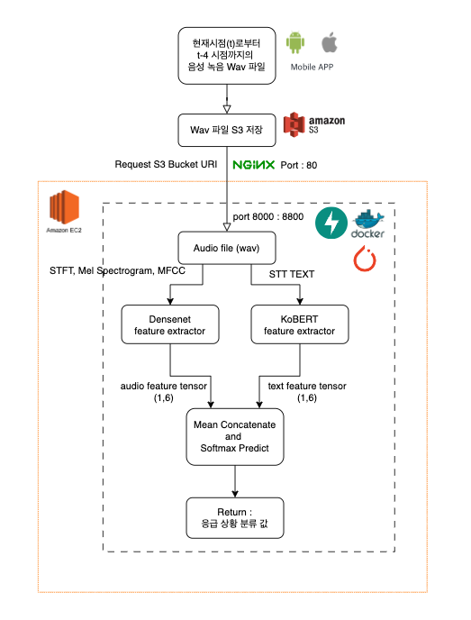

# Audio_classification_API with FastAPI

## 1. 프로젝트 소개

- 사용 모델 : Densenet, Early fusion(STFT, Mel Spectrogram, MFCC), KoBERT, Late Decision fusion(Softmax)
- 사용 언어 : python
- 사용 대표 라이브러리 : Apache Airflow, librosa, numpy, pytorch, fastapi, jinja2, boto3, timm, densenet, kobert
- KoBERT 설치는 https://github.com/SKTBrain/KoBERT 참고
- Local PC : Macbook Pro M1
- S3 : AWS S3
- AWS EC2 : t2.medium ubuntu 20.04

 

### 프로젝트 개요

- 범죄 상황에서 발생하는 음성 데이터의 위급 상황(성추행, 강도, 절도, 폭행, 도움 요청)과 일반(정상) 상황을 분류를 분류하는 API를 개발.  

[데이터 엔지니어링]
- ETL 프로세스에 맞춰 로컬에 저장되어 있는 음성 데이터들을 Librosa를 활용하여 2차원 이미지로 변환 후, AWS S3에 Hook을 시켜 업로드를 하는 DAG를 구축

[모델링]
- S3에 적재된 위급 음성으로부터 추출된 여러 컨텍스트 정보들을 활용하여 위급 음성을 분류하는 API 를 구축하였습니다.
이를 위해 Feature Extractor 모델로써 Densenet과 KoBERT를 사용하여 하였습니다
음성 피쳐 추출 모델의 일반화 성능 향상을 위해 STFT, Mel-Spectrogram, MFCC를 Early fusion을 통해 음성 피쳐를 추출합니다. 이후, Imagenet 기반의 Densenet를 Early Fusion 피쳐에 Fine-tuning 한 후, 오디오 데이터로부터 피쳐를 추출합니다.
하지만 음성 데이터만으로는 완벽한 분류를 하지 못하기 때문에 음성 데이터에서 AWS Transcribe를 통해 추출된 텍스트 데이터를 함께 사용하였습니다. 한국어 분류에 용이한 KoBERT 모델을 Fine-tuning 한 후, 텍스트 데이터에서 피쳐를 추출합니다.
위 2개의 피쳐를 Mean Concatenate 형식으로 이어붙인 후, softmax를 활용한 Late Fusion 과정을 통해 최종 결과를 추론하였습니다.

[API]
- 해당 분류 API를 pytorch와 FastAPI, Docker를 사용하여 EC2 환경에 구축하였습니다.
사용자가 음성 데이터를 어플을 통해 ML server API에 S3 URI와 함께 요청을 하면 API에서 응급 상황 여부를 보다 더 정확하게 판별할 수 있게 구성하였습니다.

### 사용 데이터
- 총 16571개의 음성 파일을 사용하였습니다 (37GB)
  - 라벨
    - 응급(성추행, 강도, 절도, 폭행, 도움 요청)
    - 정상(대사, 비대사)
      - 비대사 : 음성 파일에 대화가 없는 경우
      - 대사 : 음성 파일에 대화가 있는 경우
- 사용 데이터 출처
  - Early Fusion - Densenet Fine tuning 학습 데이터
      - [위급상황 음성/음향
  ](https://aihub.or.kr/aihubdata/data/view.do?currMenu=115&topMenu=100&aihubDataSe=realm&dataSetSn=170)
      - [자유 대화 음성 데이터(영유아)](https://aihub.or.kr/aihubdata/data/view.do?currMenu=115&topMenu=100&aihubDataSe=realm&dataSetSn=108)
      - [자유 대화 음성 데이터(성인 남녀)](https://aihub.or.kr/aihubdata/data/view.do?currMenu=115&topMenu=100)
  - KoBERT Fine-tuning을 위해 사용한 데이터입니다.
    - 일상 대화 데이터
      - [Chatbot_data_for_Korean v1.0](https://github.com/songys/Chatbot_data)
    - 범죄 현장 표현
      - 위 AI hub 데이터에서 사용된 텍스트 표현들

### Metrics

**Early Fusion(STFT, Mel Spectrogram, MFCC) - Densenet(Finetuning)** 

- Binary Label (emergency, regular)
    | Metric | Performance |    
    | --- | --- |
    | Test Accuracy | 91.93% |
    | F1 score | 92.23% |
    | Precision | 93.64% |
    | Recall | 91.98% |

- Labels (robbery', 'sexual', 'regular', 'help', 'violence', 'theft’)
    | Metric | Performance |    
    | --- | --- |
    | Test Accuracy | 59.27% |
    | F1 score | 0.551 |
    | Precision | 59.80% |
    | Recall | 59.30% |

**Text Classification(KoBERT)(Finetuning)** 
- Labels (robbery', 'sexual', 'regular', 'help', 'violence', 'theft’)
- KoBERT Fine-tuning
    | Metric | Performance |    
    | --- | --- |
    | Test Accuracy | 74.72% |
    | F1 score | 0.699 |
    | Precision | 84.54% |
    | Recall | 74.72% |

**Late Fusion(Audio feature - text feature) with softmax Test**
- Labels (robbery', 'sexual', 'regular', 'help', 'violence', 'theft’)
- Mean Concatenate - Softmax
    | Metric | Performance |    
    | --- | --- |
    | Test Accuracy | 89.15% |
    | F1 score | 0.89% |
    | Precision | 91.34% |
    | Recall | 89.19% |

 

### 데이터 전처리

- Airflow를 이용하여 데이터를 전처리 및 S3에 업로드하였습니다. 

- wav_to_spectrogram.py
  - 카테고리 별로 음성파일을 가져옵니다.
    - 음성 파일을 스펙트로그램으로 변환합니다.
    - 음성 파일을 4초 단위로 자릅니다.
    - 멜-스펙트로그램(3채널)으로 변환합니다.
    - 멜-스펙트로그램으로 변환한 후, 224x224로 resize합니다.
  - 이후 폴더를 zip 파일로 압축한 후, S3 upload DAG를 통해 트리거링합니다
- s3_upload.py
  - zip 파일을 Dataset으로써 공유하여 update가 있을 시, S3에 업로드합니다.

### 페이지 구성

- upload.html
  - API를 테스트하기 위해 만든 html 파일입니다. 
    - jinja2를 이용하여 html을 만들었습니다. 
    - upload 버튼을 누르면 음성 파일을 업로드 할 수 있습니다.
    - 파일의 용량은 1mb 이하로 제한하였습니다.
    - 음성 파일을 업로드하면 음성 파일을 분류합니다. 
    - 2가지 옵션을 선택할 수 있습니다. 
      - 음성 파일을 직접 업로드(wav)
      - 음성 파일을 S3에서 가져오기(s3_key)
      - 2가지 옵션 모두 음성 파일에 포함된 텍스트를 필요로 합니다

 

- main.py
  - FastAPI를 이용하여 API를 만들었습니다. 
  - 음성 파일을 업로드하면 음성 파일을 분류합니다. 
  - S3 버킷에 저장된 음성 파일을 분류합니다. 
  - audio 파일과 text 내용을 동시에 인풋으로 받아 응급 음성인지 아닌지 분류합니다.

- densenet.py
  - densenet 모델을 활용합니다. 
  - densenet 아키텍처를 사용한 딥러닝 모델을 정의하고, 그 모델의 가중치가 저장된 파일을 불러오는 코드입니다. 
    - 모델과 모델 관련 변수들을 선언하고, 각 변수들을 적절한 장치에 할당하는 작업을 수행합니다. 
  - 마지막으로 클래스 라벨의 이름을 정의하는데 사용됩니다.
  - `audio_feature` 함수를 이용해 해당 오디오 파일의 라벨 및 피쳐 값을 추출합니다.
    - `binary` 변수를 통해 라벨을 2개로 설정하거나 6개로 설정할 수 있습니다.
    - `audio_file` 변수를 통해 오디오 파일 주소를 입력할 수 있습니다.

- kobert_model.py
  - KoBERT 모델을 만들었습니다.
  - KoBERT 모델을 정의하고, 그 모델의 가중치를 저장된 파일에서 불러오는 코드입니다. 모델과 모델 관련 변수들을 선언하고, 각 변수들을 적절한 장치에 할당하는 작업을 수행합니다.
  - `text_feature` 함수를 이용해 해당 텍스트의 라벨 및 피쳐 값을 추출합니다.

 

## 2. 프로젝트 실행 방법

- 음성파일은 static 폴더에 저장됩니다. 
- 저장된 음성 파일이 응급 음성인지 아닌지 분류합니다.
- 엔드포인트 설명
  - /upload
    - 음성 파일을 업로드합니다.
    - 음성 파일을 직접 업로드(wav)하거나, 음성 파일을 S3에서 가져오기(s3_key)할 수 있습니다.
  - /predict
    - 음성 파일을 분류합니다.
    - 위의 엔드포인트는 클라이언트에서 업로드한 오디오 파일을 받아와서, 그 파일을 로컬 서버에 저장하고, librosa 라이브러리를 이용해 해당 파일의 오디오 데이터를 로드하고 리샘플링합니다. 
    - 이후 audio_feature, text feature 함수를 이용해 해당 오디오 파일의 라벨 및 확률 값을 예측하고, 예측 결과를 JSON 형태로 반환합니다. 이때, 엔드포인트에는 audio_file이라는 이름의 UploadFile 객체가 전달되며, 이 객체는 클라이언트에서 업로드한 파일의 정보를 담고 있습니다.
  - /predict_s3
    - 음성 파일을 분류합니다.
    - S3에 저장된 음성 파일의 S3 URI를 받아와서 해당 파일을 다운로드한 후 분류 모델로 예측을 수행하고, 예측 결과인 라벨과 피쳐값을 반환하는 FastAPI 엔드포인트입니다.
  - 위의 predict endpoint들은 multi-model 형식으로 feature extraction을 수행 후 추출된 피쳐값들을 기반하여 Decision fusion(late fusion)을 이용하여 최종 결과를 반환합니다.    

 

## 3. 프로젝트 구조

- __프로젝트 최종 구조__
  
  

- __프로젝트 최종 로직__
  

- 각 model은 cpu를 통해 inference를 수행합니다.
- 로컬 혹은 같은 환경에서 2개의 모델이 multi model 형식으로 inference를 수행합니다.
- EC2 t2.medium 기준으로 소요되는 inference time
  - densenet : 평균 1초 이내
  - KoBERT : 평균 1초 이내 (모델과 토큰나이저를 cache로 저장하여 사용)
  - Decision fusion : 평균 1초 이내 
  - 총 2초 이내가 소요됩니다
