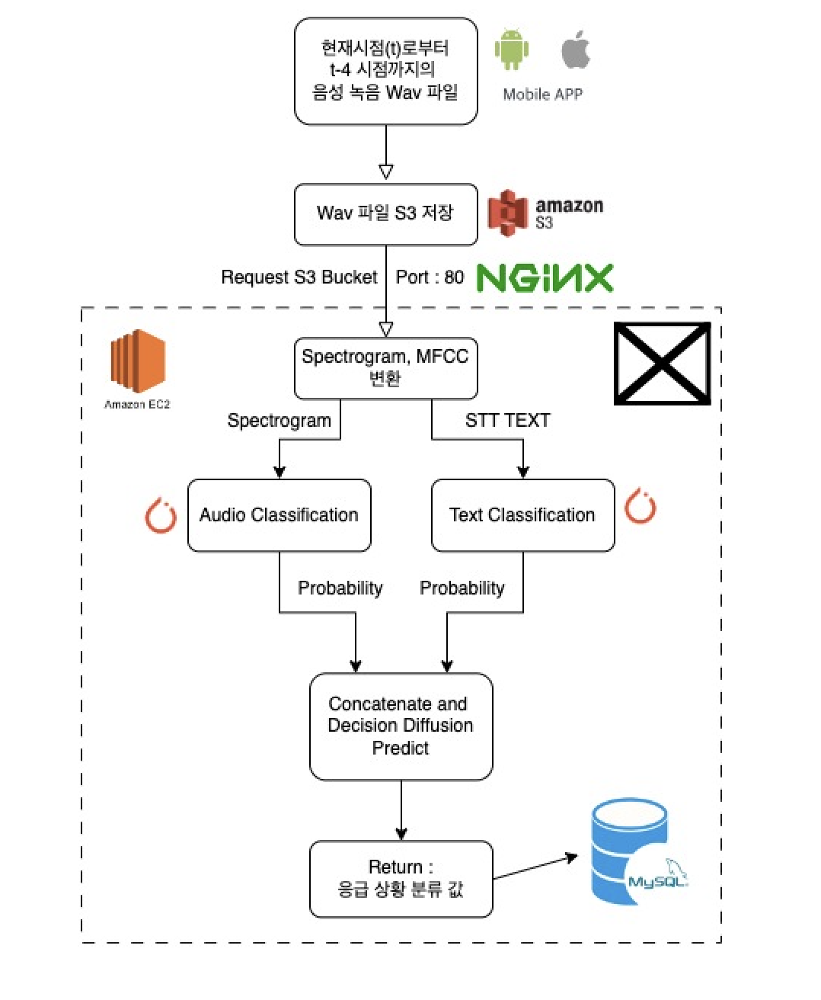

# Audio_classification_API with FastAPI

## 1. 프로젝트 소개

- 사용 모델 : RESNET, KoBERT, Decision Diffusion(ML)
- 사용 언어 : python
- 사용 대표 라이브러리 : Apache Airflow, librosa, numpy, pytorch, fastapi, jinja2, boto3, kobert
- KoBERT 설치는 https://github.com/SKTBrain/KoBERT 참고
- Local PC : Macbook Pro M1
- S3 : AWS S3
- AWS EC2 : t2.medium

 

- RESNET과 KoBERT를 이용하여 응급 음성을 분류하는 프로젝트입니다.  
- FastAPI를 이용하여 API를 만들었습니다.

 
 

- upload.html
  - API를 테스트하기 위해 만든 html 파일입니다. 
    - jinja2를 이용하여 html을 만들었습니다. 
    - upload 버튼을 누르면 음성 파일을 업로드 할 수 있습니다.
    - 음성 파일을 업로드하면 음성 파일을 분류합니다. 
    - 2가지 옵션을 선택할 수 있습니다. 
      - 음성 파일을 직접 업로드(wav)
      - 음성 파일을 S3에서 가져오기(s3_key)
      - 2가지 옵션 모두 음성 파일에 포함된 텍스트를 필요로 합니다

 
 
    
- main.py
  - FastAPI를 이용하여 API를 만들었습니다. 
  - 음성 파일을 업로드하면 음성 파일을 분류합니다. 
  - S3 버킷에 저장된 음성 파일을 분류합니다. 
  - audio 파일과 text 내용을 동시에 인풋으로 받아 응급 음성인지 아닌지 분류합니다.

- resnet.py
  - resnet 모델을 만들었습니다. 
  - ResNet 아키텍처를 사용한 딥러닝 모델을 정의하고, 그 모델의 가중치를 저장된 파일에서 불러오는 코드입니다. 모델과 모델 관련 변수들을 선언하고, 각 변수들을 적절한 장치에 할당하는 작업을 수행합니다. 
  - 마지막으로 클래스 라벨의 이름을 정의하는데 사용됩니다.
  - `audio_predict` 함수를 이용해 해당 오디오 파일의 라벨 및 확률 값을 예측합니다.

- kobert_model.py
  - KoBERT 모델을 만들었습니다.
  - KoBERT 모델을 정의하고, 그 모델의 가중치를 저장된 파일에서 불러오는 코드입니다. 모델과 모델 관련 변수들을 선언하고, 각 변수들을 적절한 장치에 할당하는 작업을 수행합니다.
  - `text_predict` 함수를 이용해 해당 텍스트의 라벨 및 확률 값을 예측합니다.

 

## 2. 프로젝트 실행 방법

- 음성파일은 static 폴더에 저장됩니다. 
- 저장된 음성 파일이 응급 음성인지 아닌지 분류합니다.
- 엔드포인트 설명
  - /upload
    - 음성 파일을 업로드합니다.
    - 음성 파일을 직접 업로드(wav)하거나, 음성 파일을 S3에서 가져오기(s3_key)할 수 있습니다.
  - /predict
    - 음성 파일을 분류합니다.
    - 위의 엔드포인트는 클라이언트에서 업로드한 오디오 파일을 받아와서, 그 파일을 로컬 서버에 저장하고, librosa 라이브러리를 이용해 해당 파일의 오디오 데이터를 로드하고 리샘플링합니다. 
    - 이후 audio_predict 함수를 이용해 해당 오디오 파일의 라벨 및 확률 값을 예측하고, 예측 결과를 JSON 형태로 반환합니다. 이때, 엔드포인트에는 audio_file이라는 이름의 UploadFile 객체가 전달되며, 이 객체는 클라이언트에서 업로드한 파일의 정보를 담고 있습니다.
  - /predict_s3
    - 음성 파일을 분류합니다.
    - S3에 저장된 음성 파일의 S3 URI를 받아와서 해당 파일을 다운로드한 후 분류 모델로 예측을 수행하고, 예측 결과인 라벨과 확률값을 반환하는 FastAPI 엔드포인트입니다.
  - 위의 predict endpoint들은 multi-model 형식으로 inference를 수행 후 반환된 확률값들을 기반하여 Decision Diffusion을 이용하여 최종 결과를 반환합니다.    

 

## 3. 프로젝트 구조

- __프로젝트 최종 구조__
  
    

- 각 model은 cpu를 통해 inference를 수행합니다.
- sagemaker 대신 로컬 혹은 같은 환경에서 2개의 모델이 multi model 형식으로 inference를 수행합니다.
- Mac M1 Pro 칩 기준으로 inference time
  - Resnet : 평균 1초 이내
  - KoBERT : 평균 1초 이내 (모델과 토큰나이저를 cache로 저장하여 사용)
  - Decision Diffusion : 평균 1초 이내 
  - 총 2초 이내가 소요됩니다